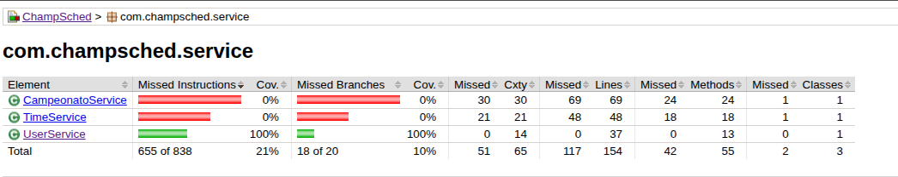
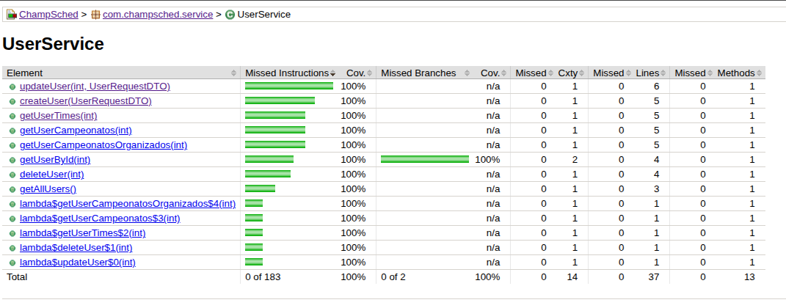

# Testes Unitários - UserService

## Resultados

| Métrica | Resultado | Meta |
|---------|-----------|------|
| **Cobertura de Código** | 100% | ≥ 60% |
| **Testes Executados** | 15 testes | - |
| **Taxa de Sucesso** | 100% (0 falhas) | - |
| **Métodos Testados** | 9/9 (100%) | - |
| **Tempo de Execução** | < 3 segundos | - |






---

## Sobre os Testes

**Classe Testada:** `UserService`  
**Localização:** `/backend/src/test/java/com/champsched/service/UserServiceTest.java`

### Tecnologias
- **JUnit 5**: Framework de testes
- **Mockito**: Criação de mocks
- **AssertJ**: Assertions legíveis
- **JaCoCo**: Relatório de cobertura

### Métodos Testados (9/9)
`createUser()` - Criar usuário  
`getAllUsers()` - Listar todos  
`getUserById()` - Buscar por ID  
`updateUser()` - Atualizar dados  
`deleteUser()` - Remover usuário  
`getUserTimes()` - Times do usuário  
`getUserCampeonatos()` - Campeonatos participados  
`getUserCampeonatosOrganizados()` - Campeonatos organizados

---

## Lista de Testes (15 testes)

### Criação de Usuário
1. **Criar usuário com sucesso** - Valida criação de novo usuário

### Listagem de Usuários
2. **Listar todos os usuários** - Retorna lista com usuários cadastrados
3. **Lista vazia** - Retorna lista vazia quando não há usuários

### Busca por ID
4. **Buscar usuário existente** - Retorna dados do usuário
5. **Buscar usuário inexistente** - Lança exceção com mensagem de erro

### Atualização
6. **Atualizar usuário existente** - Atualiza nome e contato
7. **Atualizar usuário inexistente** - Lança exceção

### Exclusão
8. **Deletar usuário existente** - Remove usuário do sistema
9. **Deletar usuário inexistente** - Lança exceção

### Times do Usuário
10. **Buscar times do usuário** - Retorna lista de times
11. **Buscar times de usuário inexistente** - Lança exceção

### Campeonatos Participados
12. **Buscar campeonatos participados** - Retorna lista de campeonatos
13. **Buscar de usuário inexistente** - Lança exceção

### Campeonatos Organizados
14. **Buscar campeonatos organizados** - Retorna lista de campeonatos
15. **Buscar de usuário inexistente** - Lança exceção

---


## Como Executar

### Requisitos
- Java 21+
- Maven 3.6+

### Comandos

**Executar testes do UserService:**
```bash
cd backend
./mvnw test -Dtest=UserServiceTest
```

**Visualizar relatório:**
```bash
# Abrir no navegador
xdg-open backend/target/site/jacoco/index.html
```

---

## Padrões Utilizados

### Padrão AAA (Arrange-Act-Assert)
Todos os testes seguem esta estrutura:

```java
@Test
void testCreateUser_Success() {
    // Arrange - Preparar dados e mocks
    when(userRepository.save(any(User.class))).thenReturn(user);
    
    // Act - Executar método testado
    UserResponseDTO result = userService.createUser(userRequestDTO);
    
    // Assert - Verificar resultados
    assertThat(result).isNotNull();
    verify(userRepository, times(1)).save(any(User.class));
}
```


---

## Referências

- [JUnit 5 Documentation](https://junit.org/junit5/docs/current/user-guide/)
- [Mockito Documentation](https://javadoc.io/doc/org.mockito/mockito-core/latest/org/mockito/Mockito.html)
- [JaCoCo Documentation](https://www.jacoco.org/jacoco/trunk/doc/)

---

